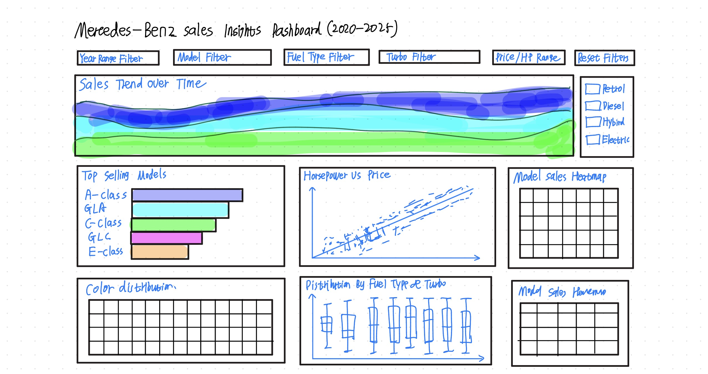

# Mercedes-Benz Sales Insights Dashboard (2020-2025)

Deployed app link: **https://data551-project.onrender.com/**

This project is an interactive dashboard for Mercedes-Benz sales data from 2020 to 2025.
This repository contains the Milestone 4 production-ready version.

## Why this project
We are a student data consulting team.
Our main users are regional dealership managers.
They need simple evidence for inventory and display decisions.

## What users can do
- Check fuel type trend by year
- Check top-selling models
- Compare horsepower and price trends by fuel type using regression lines
- Check top color choices
- Filter data by year, model, fuel type, turbo, price, and horsepower
- Use one reset button to clear all filters

## Interaction design / Dashboard layout
- Global filters: Year range, Model, Fuel type, Turbo, Price range, and Horsepower range drive the dashboard state.
- Regression panel behavior: the horsepower-price regression chart shows all fuel types for trend comparison while still respecting the other active filters.
- Hover tooltips: hovering on marks reveals exact values and key attributes to support precise reading.
- Reset: a single reset button clears all filters/selections to return to the default overview state.

## Dashboard layout
Main panels in the app:
- Fuel type sales trend
- Top models by sales
- Horsepower vs Price (fuel-type regression)
- Top colors

## Milestone 4 Highlights
- Final full-screen layout with a dedicated filter panel and KPI cards
- Improved label readability for range filters
- Refined chart titles and spacing for clearer interpretation
- Feedback-driven redesign of the horsepower-price panel to grouped regression trends
- Final reflection and feedback resolution documentation in `doc/`

## Sketch
This is our early layout sketch for dashboard design and interaction flow.



## Local setup
### 1) create environment (optional)
```bash
python -m venv .venv
source .venv/bin/activate
```

### 2) install packages
```bash
pip install -r requirements.txt
```

### 3) run app
```bash
python src/app.py
```

The app will use this file by default:
`data/raw/mb_sales_sample_stratified.csv`

If you have the full raw dataset, you can rebuild samples with:
```bash
python src/build_samples.py
```

Then open the local link in your browser.

## Project structure
```text
DATA551_Project_G11_SUN_YAO_ZHAO/
├── data/
│   ├── raw/
│   └── processed/
├── src/
├── reports/
├── doc/
├── requirements.txt
├── Procfile
└── README.md
```

## Future Improvements

In future iterations, we plan to:

- Add robust chart-to-chart click cross-filtering across all panels
- Expand KPI set (e.g., growth and segment share indicators)
- Add optional dark theme and accessibility presets
- Improve performance for larger datasets beyond current sampled workflows

## GitHub About (Milestone 4)
Suggested About description:
`Interactive Mercedes-Benz sales dashboard for dealership inventory insights (2020-2025).`

Suggested About URL:
`https://data551-project.onrender.com/`

Suggested keywords/topics:
`dash`, `altair`, `interactive-dashboard`, `regression`, `filters`, `automotive-analytics`

## For contributors
Please read `CONTRIBUTING.md` and `CODE_OF_CONDUCT.md` first.
You can open an issue for bugs, ideas, or feature requests.
If you want to help, open a pull request to `main`.

## Team files
- Proposal: `proposal.md`
- Team contract: `team-contract.md`
- Milestone submission link: `canvas-submission.md`

